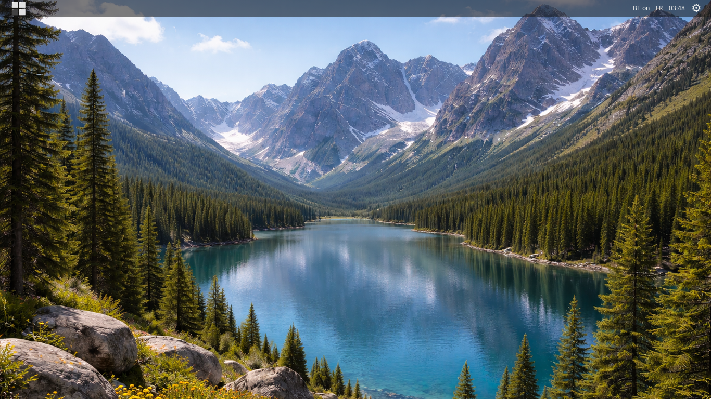
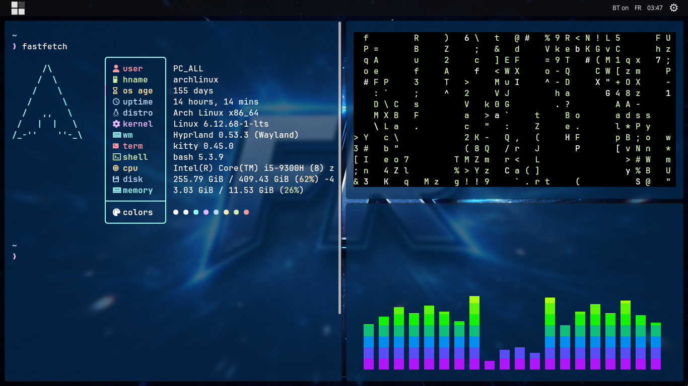

#Fjavierl - FR Dotfiles

Clean UI and workflow optimization.

A minimal, structured and productivity-focused Hyprland setup for Arch Linux.

IMPORTANT: this working project will be continued in my other FR Dotfiles repository (AGS), [fjavierl FR]
---

## Screenshots




---


## Video Preview

[](https://www.youtube.com/watch?v=Jrcreo8ihBo)

▶ Click to watch on YouTube


## Installation

```bash
git clone https://github.com/fjavierl/dotfiles.git
cd dotfiles
chmod +x install.sh
./install.sh
